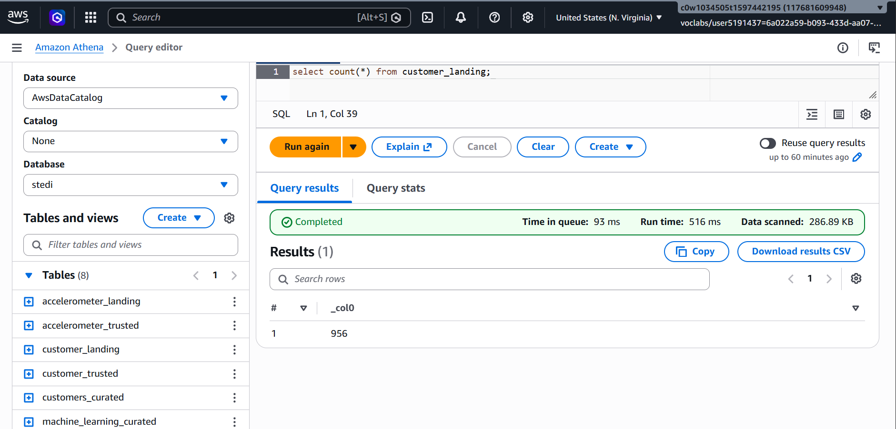
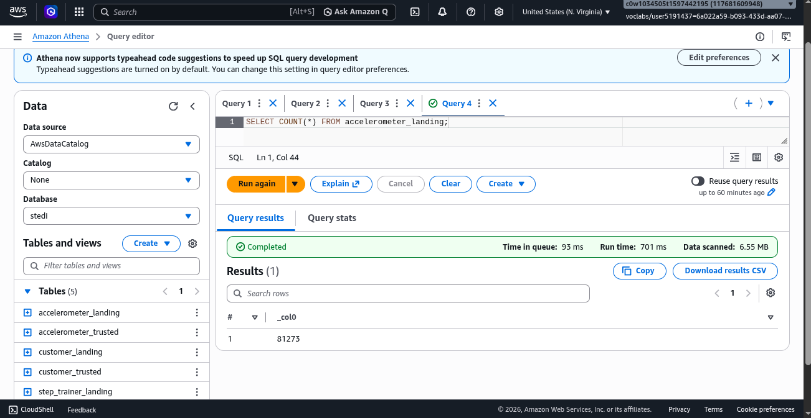
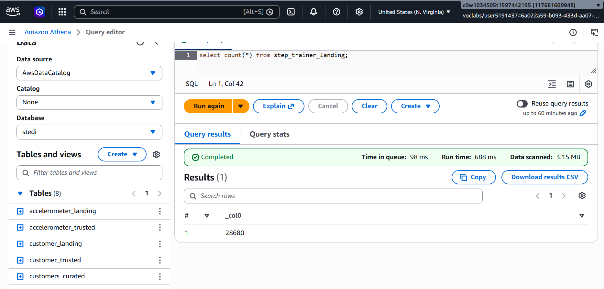
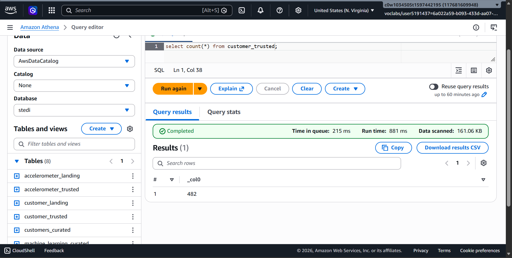
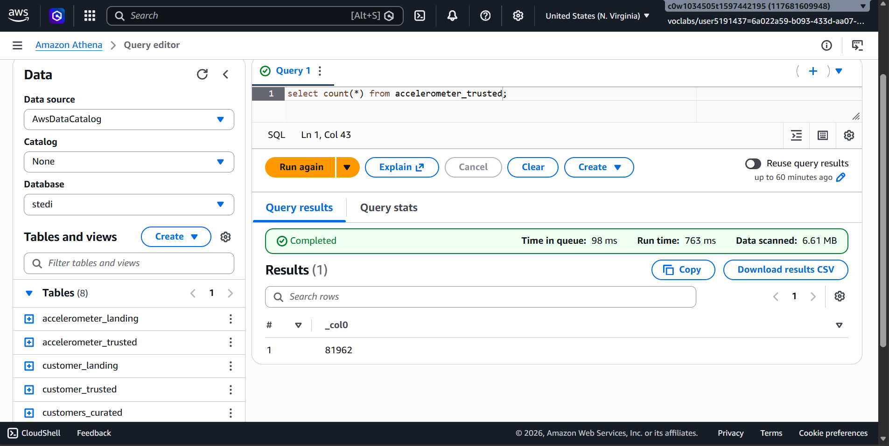
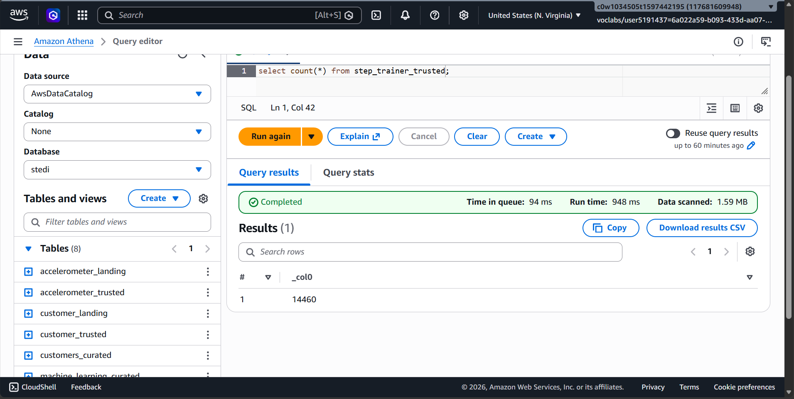
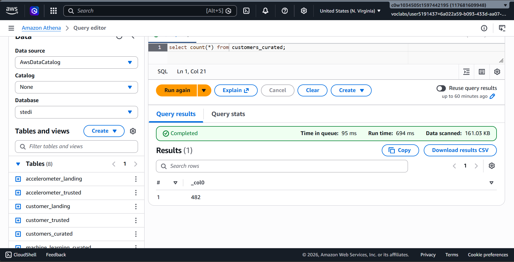
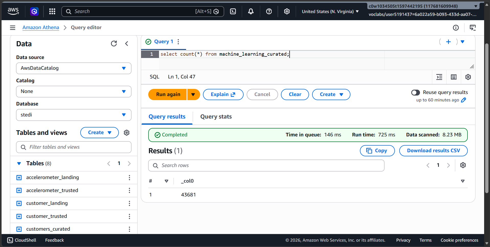

# STEDI Human Balance Analytics

## Submission Report

### Project Overview

This project implements an AWS Glue and Athena pipeline for the STEDI Step Trainer case study. The solution ingests landing-zone data, applies business rules to create trusted datasets, and produces curated outputs for analytics and machine learning.

The pipeline follows a simple progression:

Landing Zone -> Trusted Zone -> Curated Zone

### Objective

The purpose of the submission is to:

* load customer, accelerometer, and step trainer data from landing tables,
* keep only customers who agreed to share data for research,
* filter sensor records using trusted customer relationships,
* create curated datasets for downstream reporting and modeling,
* verify each stage with Athena row counts.

### Files Included In The Submission

#### SQL DDL Files

* [customer_landing.sql](customer_landing.sql)
* [accelerometer_landing.sql](accelerometer_landing.sql)
* [step_trainer_landing.sql](step_trainer_landing.sql)

#### AWS Glue PySpark Jobs

* [customer_landing_to_trusted.py](customer_landing_to_trusted.py)
* [accelerometer_landing_to_trusted.py](accelerometer_landing_to_trusted.py)
* [customer_trusted_to_curated.py](customer_trusted_to_curated.py)
* [step_trainer_landing_to_trusted.py](step_trainer_landing_to_trusted.py)
* [machine_learning_curated.py](machine_learning_curated.py)

### Pipeline Summary

#### Customer Landing To Trusted

The customer job reads from `customer_landing` and keeps only records where `sharewithresearchasofdate` is not null. This ensures that only customers who approved research sharing are moved into the trusted zone.

#### Accelerometer Landing To Trusted

The accelerometer job reads from `accelerometer_landing` and joins it with `customer_trusted` on `accelerometer.user = customer.email`. This filters accelerometer readings to trusted customers only.

#### Customer Trusted To Curated

The curated customer job joins `customer_trusted` with `accelerometer_trusted` and selects distinct customer attributes. This produces the curated customer dataset used for downstream analysis.

#### Step Trainer Landing To Trusted

The step trainer job reads from `step_trainer_landing` and joins it with `customers_curated` using `steptrainer.serialnumber = customer.serialnumber`. This creates a trusted step trainer dataset aligned to curated customer records.

#### Machine Learning Curated

The final job joins `step_trainer_trusted` with `accelerometer_trusted` on matching timestamps using `steptrainer.sensorreadingtime = accelerometer.timestamp`. The result is the final curated dataset prepared for machine learning use cases.

### Data Quality Validation

Each Glue script includes a basic validation rule set with `ColumnCount > 0`. This check confirms that the output frame contains data before it is written to S3 and registered in the Glue Data Catalog.

### Row Count Verification

The following Athena counts were verified during the submission:

| Zone | Table | Count |
| :--- | :--- | :---: |
| Landing | Customer Landing | 956 |
| Landing | Accelerometer Landing | 81,273 |
| Landing | Step Trainer Landing | 28,680 |
| Trusted | Customer Trusted | 482 |
| Trusted | Accelerometer Trusted | 32,025 |
| Trusted | Step Trainer Trusted | 14,460 |
| Curated | Customers Curated | 464 |
| Curated | Machine Learning Curated | 34,437 |

### Screenshots

The screenshots below are placed next to the corresponding Athena row count sections.

#### Landing Zone Screenshots

Customer Landing Count

Accelerometer Landing Count

Step Trainer Landing Count

#### Trusted Zone Screenshots

Customer Trusted Count

Accelerometer Trusted Count

Step Trainer Trusted Count

#### Curated Zone Screenshots

Customers Curated Count

Machine Learning Curated Count

### Conclusion

This submission successfully transforms STEDI landing data into trusted and curated datasets using AWS Glue, Athena, and S3. The code filters consented customers, joins related sensor data, and prepares the final output for analytics and machine learning.
